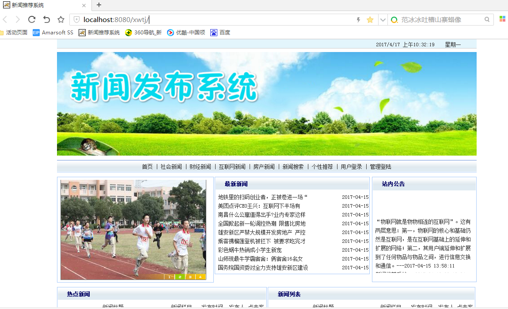
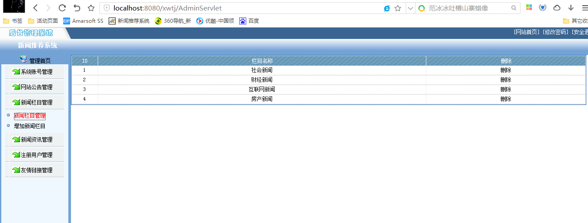
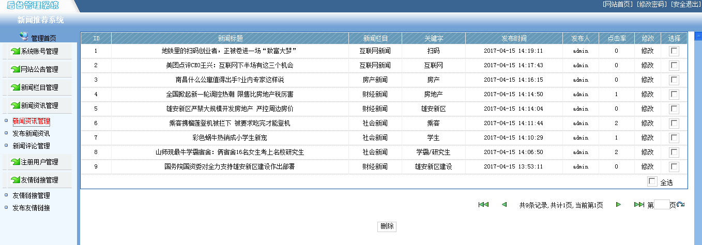
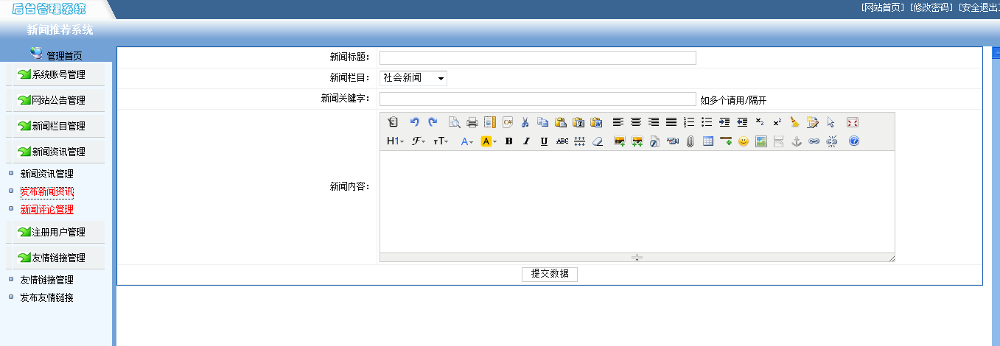
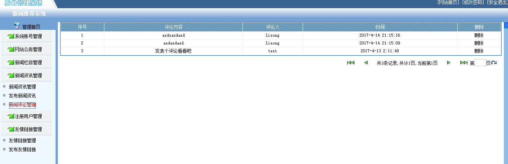
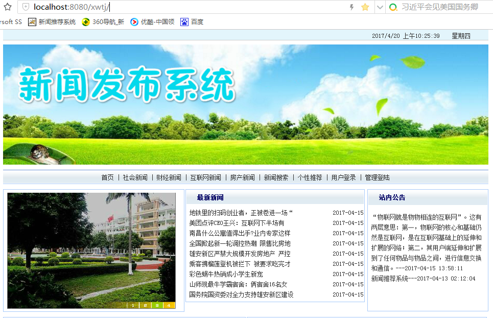

<h1 align="center">基于JSP+Servlet实现的新闻发布系统【带报告】</h1>

 获取sql文件 QQ: 605739993 QQ群: 377586148 

 [源码获取网站: 从戎源码网](https://armycodes.com/)

## 简介

> 本代码来源于网络,仅供学习参考使用!
>
> 提供1.远程部署/2.修改代码/3.设计文档指导/4.框架代码讲解等服务
>
> 管理员登录地址：http://localhost:8080/photoalbum/admin/
>
> 管理员: admin 密码: admin
>
> 用户登录地址：http://localhost:8080/photoalbum/
> 
> 用户：zhangsan 密码: 123

## 项目介绍

基于JSP+Servlet实现的新闻发布系统新闻发布及管理系统，主要功能如下

**（1）用户管理：**
	用户注册：新用户注册
	用户登录：新用户登录
	找回密码：忘记密码找回密码
	用户评论：发表对新闻的评论
**（2）管理员管理：**
	系统管理：
	系统账号管理：管理员管理系统现有账号，进行删除停用等操作
	系统公告管理：系统公告的发布和删除
	新闻栏目管理：新闻栏目的新增和删除
	新闻资讯管理：新闻资讯的新增和删除
	注册用户管理：注册用户的删除和冻结
	友情链接管理：添加和删除友情链接功能
	新闻评论管理：删除用户不当评论
**（3）其他：**
	安全退出主页面，返回登录页面。

## 环境

- <b>IntelliJ IDEA 2020.3</b>

- <b>Mysql 5.7.26</b>

- <b>Tomcat 8.0.32</b>

- <b>JDK 1.8</b>

## 运行截图

